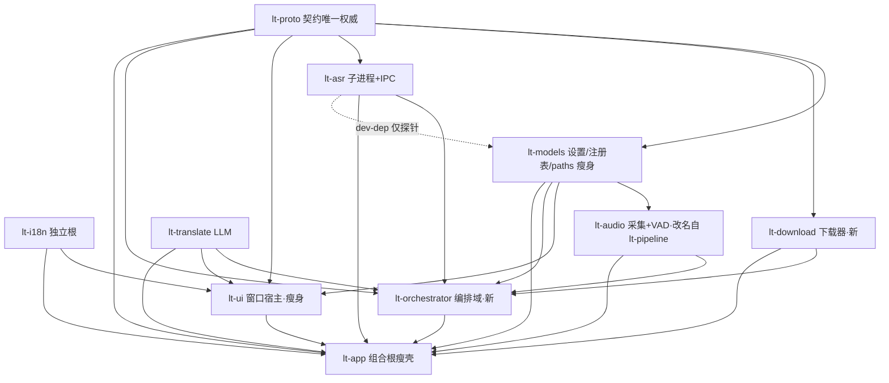

# LiveTranslate-rs 架构 2.0 方案：目标架构与迁移路线

- **定稿日期**：2026-09-09
- **证据基线**：commit `314644b`（评审基线）+ `4d7d84f`（评审报告 `docs/architecture-review.md`）；405 测 = 398 常规 + 7 ignored
- **取证方法**：评审报告（6 只读子代理七维度 + 主线程交叉验证）之上，本方案另派 4 路专项取证——①lt-app 装配层全测绘 ②lt-ui 窗口巨石全测绘 ③契约/设置镜像/字符串旁路精确定性 ④外部选型调研（arc-swap / winit 事件模型 / panic 监督 / 单实例激活 / 依赖治理 / channel 生态 / CI runner 现状，来源见 §8.3）。主线程另通读 `crates/lt-app/src/main.rs` 全文与根 `Cargo.toml` 复核。
- **效力**：阶段二活跃施工依据（本目录，非归档）。各波次（§5）为独立工作包，可按裁决调整顺序与取舍；契约变更本身仍随波次落地。**本文档先行独立 `docs(arch)` 提交，先于一切实现提交**（docs 提交时机纪律）。
- **状态**：方案定稿，待裁决开工。

---

## 0. 总判断：不是全盘史山，是五处结构性病灶

先校准一个认知：**这不是一套需要推倒重来的史山**。评审与本轮专项取证共同证明——战术层纪律显著高于平均水平（分层由 cargo 依赖图真实强制、D-33~D-37 五轮 Win32 实战修复带根因注释入码、405 测行为锚、VAD 代际校验等全仓最精巧的并发设计、ASR 进程隔离三层孤儿防护、字体仓库自洽硬保证）。**真正的山集中在五个结构性病灶**，它们都是"增长痛"而非"烂地基"：

| # | 病灶 | 一句话 | 严重性 |
|---|---|---|---|
| ① | **谎言拓扑** | 宣称的八级单向链不存在；真正的"管道"（编排域 1890 行）寄居组合根 lt-app；lt-pipeline 名不副实（实为采集+VAD）；lt-ui 依赖 5 个内部 crate 成"第二 main"；分层 purity 逼出逻辑复制 | 每次新功能都在错的地方长肉 |
| ② | **字符串走私** | 冻结契约被四条隐形字符串协议掏空（下载进度 `\t` 拼串、失败类型前缀还原、`__DONE__` 哨兵骑日志总线、`Menu("quit")` 字符串命令）；i18n 解析失败静默空表 | 协议无 schema，任何一端改格式都编译通过 |
| ③ | **设置镜像网** | Settings 运行时存在 **7 个副本** + 人肉同步边 + qwen3 钳制写穿共享 VAD 生效值 | AH-3 类 bug 的结构性温床 |
| ④ | **无监督线程树** | ~10 处裸 `thread::spawn`、全仓零 panic hook、线程死亡不可观测不可恢复（models_dir 杀 ASR 线程、JobPool worker panic 永死、bench panic 永卡 UI）、半初始化泄漏 | P0：僵尸管道静默运行 |
| ⑤ | **UI 巨石与双真源** | AppState 3043 行 ~40 平铺字段横跨 6 窗、`&mut` 全量分发、可见性双真源、同步 rfd 冻结全部窗口、boot 早期失败黑洞 | 边界靠命名纪律，改一处动全身 |

**该保留的保留（§1 资产清单，12 项），该革新的大胆革新（§3 目标架构，五病灶逐一拆除）。** 任何波次落地都保持全测绿——git 管历史，波次即提交序列，任何一波可独立 revert。

### 0.1 为什么不大爆炸重写

1. **资产占比过高**：Toast/EXSTYLE 自愈/托盘线程协议/手工拖动/分区穿透——每一项都是实机反复取证换来的（大坑 13~17 全部是血泪实锤），重写必然重踩。
2. **405 测是行为锚**：绞杀式（strangler）迁移每波全绿 = 任意时点可发版；大爆炸分支在无 CI 期间合并风险不可控。
3. **病灶边界已被评审划清**：shell 只调 `Pipeline` 七个方法、ASR 三态错误穿透全栈无折损、编排域函数清单完整（§8.1）——手术切口现成，缝合成本低。
4. **单人 + AI 协作模式**：小波次的可验证性与可回滚性 >> 大分支的原子性幻觉。

---

## 1. 资产清单（明确保留，禁止在迁移中"顺手重写"）

以下 12 项是本方案的**保护对象**，各波次施工时只许平移、不许改行为；如必须触碰，须在波次施工卡中单独列明理由。

| # | 资产 | 证据 | 保留理由 |
|---|---|---|---|
| A1 | **单回流通路**：所有后台线程→UI 仅 EventLoopProxy 一条路；AppState 单线程独占 | 评审 §2.3；lt-app 全部 spawn 点取证 | 全项目最大亮点，D-33~D-37 可推理的基础 |
| A2 | **BoundedDropQueue**（满丢最旧 + 确定性丢弃告警） | chunk cap100 / segment cap16 | 数据面有界背压的成熟实现 |
| A3 | **VAD 乐观代际校验**（`generation` 单调号 + `trim_front_checked`） | lt-pipeline/vad.rs；interim.rs 635 行纯函数 | 全仓最精巧并发设计，识别期不持锁 |
| A4 | **ASR 进程隔离三件套**（子进程 + 长度前缀帧 IPC + Manager 状态机）、fake worker 复用真实 `worker::run` | lt-asr 3625 行；`abort()` 注入测试 | 崩溃隔离/挂死可杀/RSS 确定性回收 |
| A5 | **托盘专用线程协议**（GetMessage 泵 + mpsc + 限时退出） | lt-ui/tray.rs；D-35 | 大坑 16 的完整解 |
| A6 | **WinAction 动作队列（16 变体）+ Tick 表 + repaint 回环纪律 + EXSTYLE 每帧实测重挂** | state.rs:122-160；app.rs:1819-1825 / 362-393 | 大坑 1/15 的完整解，评审专项结论"防御式架构是对的选择" |
| A7 | **字体仓库自洽**（三内嵌字体链尾兜底 + 常驻字形覆盖测试 + `resolved` 表） | lt-ui/fonts.rs 722 行 | D-17 硬保证 |
| A8 | **注册表平行数组单一事实源**（等长校验 + sha256 格式校验 + 编译期断言） | lt-models/registry | 下载/探测/完整性基线一源三用 |
| A9 | **下载器完整性工程**（原子写/续传/total=None 拒绝/磁盘预检/九类 FailKind 谓词 + 全组合测试） | lt-models/download 982 行 | DL-1~6 成果 |
| A10 | **文档-代码双向锚定**（几乎每个非平凡决策点带 D-xx/AH-x 注释） | 全仓 | 演进时"对照注释逐点复核"而非考古 |
| A11 | **headless UI 测试体系**（`ctx.run_ui` 驱动真实 UI 闭包 + widget_stability 集成测） | lt-ui 146 测 | GUI 回归护栏 |
| A12 | **tokio 边界纪律**（`TranslateStream` 把 async 流伪装成同步迭代器，消费方零 tokio 知识） | lt-translate | 务实且边界干净 |

---

## 2. 设计原则（从证据推出，施工时的裁决依据）

- **P1 类型即契约**：一切跨 crate 边界的数据流必须是有类型 enum/struct；字符串编码协议（分隔符/前缀/哨兵）一律禁止。冻结规则修订为"**纯新增类型化变体/字段豁免评审，删改型/改语义仍须评审**"（§3.3）——否则走私只会继续增殖（评审 §4.1 结论）。
- **P2 单一真源，单向流**：每个事实只有一个所有者。设置运行时真值 = 发布的不可变快照（§3.2）；窗口可见性 = WindowManager（§3.4）；引擎能力 = 注册表。副本一律是派生视图，不是平行真值。
- **P3 一切线程可观测、可恢复**：仓库内不允许裸 `thread::spawn`（白名单 §6.2）；线程死亡是类型化事件（`ThreadDied`）；致命条件进**待命态**而不是 `return` 杀线程（AH-1 哲学推广）；半初始化一律守卫回滚。
- **P4 UI 是投影**：UI 持编辑草稿与显示状态，域逻辑与硬件枚举全部下沉；UI crate 依赖收窄到最小集（§3.1）。
- **P5 防御式自愈保留**：EXSTYLE 每帧实测、50/100ms Win32 轮询、托盘限时退出——保留原样（评审 §3.4 专项结论），新窗口位一律遵守"每帧实测缺位即重挂"规则。
- **P6 迁移不改行为**：每波全测绿；波次内纯粹的结构移动与行为修正分开提交，行为差异登记 D-xx（建议架构波次占用 **D-60 起**，避开 data-lifecycle 候选的 D-38~ 段，以届时裁决为准）。
- **P7 架构可验证**：依赖方向、spawn 禁令、字符串旁路禁令全部脚本化进 CI（§6）——架构不是愿景，是每次提交都被机器检查的约束。

---

## 3. 目标架构

### 3.1 Crate 拓扑 v2（八库 → 十库）



**依赖白名单表**（`scripts/check_deps.ps1` 断言对象，§6.1；表内未列的内部依赖一律非法）：

| crate | 允许的内部依赖 | 职责重定义 | 相对现状的变化 |
|---|---|---|---|
| lt-proto | — | 契约唯一权威：`UiMsg`/`UiEvent`/`Cmd`/`TrayCommand`/`Settings`/`DownloadFailKind`/`ThreadRole` + `PROTO_VERSION` | 增类型化事件（§3.3） |
| lt-i18n | — | 不变 + 键集全量校验 + 解析失败硬错（R14） | 加测试 |
| lt-models | proto | Settings/注册表/paths/cache 探测，**无网络依赖** | 迁出 download/ 982 行 |
| lt-download | proto | 下载器（reqwest/sha2/退避/完整性） | 新，自 lt-models 迁入 |
| lt-audio | models | wasapi 采集 + VAD + 队列 + 设备枚举 + `AudioStatus` 上报 | **改名自 lt-pipeline**；删 proto 死依赖 |
| lt-asr | proto（models 仅 dev-dep） | 不变 + 引擎档案化超时 + engines 收敛 | 删 `probe_models_root` 私有副本 |
| lt-translate | — | 不变 + bench 事件类型化 | 删 `__DONE__` |
| lt-orchestrator | proto, models, download, audio, asr, translate | **编排域**（自 lt-app/pipeline.rs 迁入）+ 线程监督器 + 设置总线 + 下载管理 + 设备/基准探测；**禁依赖 ui/winit** | 新，全方案核心 |
| lt-ui | proto, i18n, models, translate | 窗口宿主：AppUi 拆分 + WindowManager + 设备/基准事件化 | 删 lt-pipeline 依赖；AppState 拆分 |
| lt-app | 全部（10 crate） | 组合根瘦壳：boot v2 + 事件动脉桥 + 命令路由 + 托盘桥 + 单例 + worker 入口；目标 ≤900 行 | pipeline.rs(1890)/backend.rs 下载域迁出 |

命名勘正说明：`lt-pipeline` 改名 `lt-audio` 不是审美洁癖——该 crate 从未包含 pipeline（编排域一直在 lt-app），名字本身是拓扑谎言的一部分；编排域独立后此谎言会加倍误导。改名随 W3 与编排域迁移同波落地（纯 `git mv` + 符号替换，git 历史可完整追踪）。

### 3.2 运行时模型 v2

#### 3.2.1 线程监督器（Supervisor，lt-orchestrator）

全仓唯一合法的线程出生点是 `Supervisor::spawn`（白名单外禁令，§6.2）：

```rust
pub enum Policy { Never, Always, Backoff { base_ms: u64, max: u32 } }

pub struct Supervisor { /* entries + monitor + sink + stop */ }
impl Supervisor {
    /// 出生即登记：命名线程 + 死亡监视 + 按 policy 重启（闭包工厂模式）
    pub fn spawn(&self, role: ThreadRole, policy: Policy, factory: impl Fn() -> Job + Send + 'static);
}
// 监视：单 monitor 线程 500ms 扫描 join；死亡 → tracing + UiEvent::ThreadDied{role, detail, restarted} → 按 policy 重启；
// Backoff 超限 → 放弃重启 + 告警事件（不再静默）。
```

| 线程 | policy | 死亡语义变化 |
|---|---|---|
| lt-capture | Always | 死亡可见 + 自动重生（现在：静默死，chunk 无限丢弃） |
| lt-asr-main | Always | 死亡可见 + 重生进待命态（现在：`tl_switch` send 全部静默失败，R3 根除面） |
| lt-tl-0..7 | Always | 现在：panic 永死不重生（agent A 实锤：handle 丢弃） |
| lt-bench | Never | 完成/死亡都发 `BenchEvent::Finished`（现在：panic 后 `bench_running` 永卡 true） |
| lt-download | Never | 会话级，死亡 = `DownloadFailed{kind:Disk,…}` |
| lt-backend / lt-logbridge / lt-singleton | Always（app 侧另建一个 Supervisor 实例） | 命令线程死亡可见（现在：UI send 静默失败） |

**panic hook**（main 最早安装，W1）：`std::panic::set_hook` → 格式化（`PanicHookInfo::location` + `thread::current().name()`）→ tracing 已初始化则 `error!` + 追写 `logs/crash-<ts>.log`，未初始化则直写 crash 文件。**hook 内禁止 MessageBoxW**（可能运行在 winit 线程上，D-33 禁令适用；外部证据：alacritty 的 hook 弹 MessageBoxW 的做法本项目不可效仿，§8.3-3）。

**半初始化守卫**（R12）：`Pipeline::start` 三处 `?` 提前返回点（pipeline.rs:368-372 / 411-431 / 458-476）收敛为 `StartGuard`，Drop 时 `backend.stop()` + 已 spawn 线程 stop+join；disarm 后移交 Pipeline。

#### 3.2.2 事件动脉（Event Artery）

现状：proxy 每条事件一次 `PostMessageW` 唤醒、winit 无任何合并（外部证据 §8.3-2：winit 0.30.13 `send_event` 逐条 PostMessage，eframe/alacritty 均用"粗唤醒 + 渠道排空"模式）——而本项目日志逐条直灌（logging.rs:129-147）+ UpdateMonitor 31/s 无节流（R23）。

目标拓扑：

```mermaid
graph LR
  O[lt-orchestrator 各线程] -->|push 满丢最旧| Q[BoundedDropQueue&lt;UiEvent&gt; cap 4096 +丢弃计数]
  L[lt-logbridge 日志桥] -->|push| Q
  B[bench/download/设备探测] -->|push| Q
  Q -->|wake 信号 bounded(1) try_send| BR[lt-app 桥线程]
  BR -->|drain 至空 → 单次唤醒| P[EventLoopProxy<br>UiMsg::Events&#40;Vec&lt;UiEvent&gt;&#41;]
  P --> S[shell 逐帧排空分发]
```

- 生产侧无锁丢最旧：**复用资产 A2 `lt-audio::BoundedDropQueue<T>`**（audio/mod.rs:155-199，泛型、`push` 即满丢最旧、`pop_timeout` 阻塞读）——动脉 cap 4096 与 JobPool keep-latest 64（W1）用同一原语，**零新增外部依赖**（§3.6）；唤醒侧 bounded(1) 信号位（满 = 桥已待醒，丢弃）——alacritty Wakeup 同款模式。
- **UpdateMonitor 退出事件面**：capture 每 chunk 写 `Arc<ArcSwap<MonitorSample>>` 快照格；悬浮窗可见时以 ~33ms Monitor tick 读格重绘（有界重绘率，语义等价现 31/s 事件驱动）；`UpdateMonitor` 变体随 W2 删除。sysinfo 1s 采样 tick 不变。
- `UiMsg::Events(Vec<UiEvent>)` 批量变体 + 保留单条 `Event(UiEvent)` 便利变体。

#### 3.2.3 设置总线（SettingsBus）

现状 7 副本（§8.2-3）：UI `AppState.settings`、backend.rs:46 命令线程镜像、`AsrRuntime`（pipeline.rs:823-827）、`AsrPendingHandle` 语言/pad 面（lt-asr/manager.rs:50-77）、Translator MutableState 设置面（translator.rs:196-203）、`vad_update` 单槽（pipeline.rs:293）、VadProcessor 内部生效值——同步靠人肉边（ApplySettings 重放 / TlSwitch::AsrLanguage/Pad / StartDownload 现场重算），qwen3 钳制直接写穿共享 VAD 生效值（pipeline.rs:649-658 / 1127-1137，R18）。

目标：**arc-swap 不可变快照，单写者发布，读者无锁**（选型证据 §8.3-1：arc-swap 1.9.2 活跃维护，官方文档点名的 configuration snapshot 场景；读者全为同步线程、写者 <1Hz，tokio watch 的 RwLock 读守卫与 async 通知不划算）：

```rust
pub struct SettingsBus { current: Arc<ArcSwap<EffectiveSettings>> }

pub struct EffectiveSettings {          // 不可变，Clone 廉价（内部 Arc）
    pub raw: Arc<Settings>,             // 提交态设置（UI 编辑/持久真值经 Cmd 提交）
    pub engine: EngineKey,              // asr_engine + 档位规范化键
    pub vad: VadSettings,               // 派生视图①：已含引擎钳制 overlay（raw 永不被改写，R18 根除）
    pub asr_lang: AsrLangView,          // 派生视图②：language + sensevoice/whisper pad
    pub tl: TlView,                     // 派生视图③：target_language / timeout / active ModelConfig
    pub version: u64,                   // 单调号：读者廉价比对"是否变了"
}
impl SettingsBus {
    pub fn publish(&self, raw: Settings) -> u64;   // 唯一写入口 = orchestrator（ApplySettings/SwitchEngine/语言/pad/超时到达点）
    pub fn load(&self) -> Arc<EffectiveSettings>;  // 读者：capture / ASR transcribe 前 / 翻译池提交前 / 下载 targets / backend
}
```

| 现副本 | v2 去向 |
|---|---|
| UI `AppState.settings` | **保留**：编辑草稿 + 落盘真值（DEC-4 单写者不变，300ms 防抖 ApplySettings 提交） |
| backend.rs 命令线程镜像 | 删 → 读 bus（下载 targets 现场重算改读 `load()`） |
| `AsrRuntime` 语言/pad | 删 → transcribe 时 `load().asr_lang`（`AsrPendingHandle` 语言/pad 参数化，退化为纯控制句柄） |
| Translator MutableState 设置面 | 删 → 提交翻译前读 `load().tl`（history 等会话态保留自有） |
| `vad_update` 单槽 | 删 → capture 每轮 `load()` 比对 `version`+`mode`，变了才 `update_settings`/换置信度源 |
| VadProcessor 内部生效值 | 保留（引擎内部态），但**只是快照的接受端**，永不被钳制写穿 |
| qwen3 钳制两处散点 | 归一为 `EffectiveSettings` 派生时的 overlay（`effective = min(user, 15s)`），用户原值永存 |

同步语义：`publish` 幂等重算全部派生视图——ApplySettings 重放、专用快捷命令（SetAsrLanguage/SetPadding）殊途同归，正确性不再依赖"记得补同步边"（R10 根除）。

### 3.3 契约 v2（lt-proto 增删清单 + 冻结规则修订案）

**新增**（加法豁免，随所在波次常规提交）：

```rust
// events.rs v2 增（W1~W2 陆续落地）
UiEvent::Download(DownloadEvent)        // 替代 DownloadProgress(String)
pub struct DownloadEvent { pub repo: String, pub file: String, pub index: u32, pub count: u32,
                           pub done: u64, pub total: Option<u64>, pub phase: DownloadPhase }
pub enum DownloadPhase { Start, Progress, Integrity }
UiEvent::DownloadFailed { kind: DownloadFailKind, message: String }   // 替代 DownloadFailed(String)
pub enum DownloadFailKind { Net, Http(u16), Disk, Length, Checksum, Cancelled }  // 自 lt-models FailKind 迁入 proto（谓词函数 retryable/fallback_candidate 与全组合测试随迁）
UiEvent::Capture(CaptureEvent)          // 新增：音频采集可见性（R4）
pub enum CaptureEvent { Unavailable { role: AudioRole, error: String }, Recovered { role: AudioRole } }
pub enum AudioRole { Loopback, Mic }
UiEvent::Bench(BenchEvent)              // 替代 __DONE__ 哨兵
pub enum BenchEvent { Line(String), Finished { ok: bool, elapsed_ms: u64 } }
UiEvent::ThreadDied { role: ThreadRole, detail: Option<String>, restarted: bool }
pub enum ThreadRole { Capture, AsrMain, TlWorker, LogBridge, Download, Backend, Tray, Bench, DeviceProbe, Singleton }
UiEvent::QueuePressure { queue: QueueId, dropped_total: u64 }   // 翻译池水位告警（R15）
UiEvent::SettingsPersistFailed { error: String }                // UX 三期立项的呈现钩子
UiEvent::Devices(DeviceList)            // 设备枚举下沉后的回流（R13）
pub struct DeviceList { pub outputs: Vec<DeviceEntry>, pub inputs: Vec<DeviceEntry>, pub default_output: Option<String> }
UiEvent::SecondInstance                 // WD-5 二次启动激活
UiMsg::Events(Vec<UiEvent>)             // 事件动脉批量变体
UiMsg::TrayCommand(TrayCommand)         // 替代 Menu(String)/Tray(String)（变体清单按 tray.rs:34-40 + overlay.rs:268 实际项枚举化）
Cmd::RefreshDevices / Cmd::RunBench{..} / Cmd::CancelBench
pub const PROTO_VERSION: u32;           // 结构性增删时递增
```

**删除**（本方案即评审记录，随 W2 一次性双端迁移）：

| 删除项 | 被什么替代 | 原旁路证据 |
|---|---|---|
| `UiEvent::DownloadProgress(String)` | `Download(DownloadEvent)` | backend.rs:389-397 拼串 → app.rs:1978-1995 反解析 |
| `UiEvent::DownloadFailed(String)` | `{kind, message}` | lt-models `Display` 前缀 → state.rs:1261-1288 逐前缀还原 |
| `UiEvent::UpdateMonitor` | Monitor 快照格（§3.2.2） | 31/s proxy 泛洪（R23） |
| `UiMsg::Menu(String)` / `UiMsg::Tray(String)` | `TrayCommand(TrayCommand)` | backend.rs:127 `Menu("quit")` 借道托盘语义 |
| `Cmd::Start`（死契约） | —（无人发送无人处理，shell.rs:235 兜底臂） | W0 即删 |
| bench `__DONE__` 哨兵 | `BenchEvent::Finished` | bench.rs:402 → app.rs:1053 → benchmark_tab.rs:80 三端 |

**不变**：`AddMessage`/`UpdateTranslation`/`UpdateStreaming`/`AsrDevice`/`AsrUnavailable`/`LogLine`/`DownloadSucceeded`/`DownloadCancelled`/`ModelLoadStart`/`ModelLoadDone`/`TranslatorUnavailable`/`TestTranslatorResult` 及 `Cmd` 其余全体。`LogLine` 语义收紧为**仅人读日志**——机器控制流寄生日志总线从此禁止（防线：§6.2 grep 禁令）。

**冻结规则修订案**（W2 落入 AGENTS.md）：

> lt-proto 仍为契约唯一权威，`PROTO_VERSION` 随结构变更递增。豁免评审：纯新增 Cmd/UiEvent/TrayCommand 变体、纯新增 Settings 字段（须 serde default 兼容旧档）、既有枚举增项。仍须评审（记录入决策史 D-xx）：删除/改名/改型/改语义任何既有契约项。**新增禁令：任何跨 crate 边界的字符串编码协议（前缀/分隔符/哨兵值）一经发现按 P1 立案。**

### 3.4 lt-ui v2：AppUi 拆分 + WindowManager 单真源

**AppUi 拆分**（R8；取证基础：§8.2-1 字段-窗口归属清单——绝大多数字段只被单一窗口模块读写，天然切分面现成）：

```rust
pub struct AppUi {                  // 仍单线程独占（A1 保留）
    pub settings: Settings,         // 编辑/持久真值（不变）
    pub ctx: UiContext,             // 只读共享：fonts（内嵌可变性收敛于此）、i18n 快照、注册表显示信息
    pub session: SessionView,       // running / cmd_tx / 可见性只读快照 / pipeline_error
    pub overlay: OverlayUi,         // monitor/messages/stats/overlay 几何/ov_* 复选（原 8 散字段归组）
    pub subtitle: SubtitleUi,       // subtitle + hint + 跨域意图（open_panel_request 等由根消费）
    pub panel: PanelUi,             // panel + download + translator_error + test_translator + 300ms 防抖脏标
    pub log: LogUi,                 // logwin（日志窗与面板日志 tab 双视图共享，保持）
    pub bench: BenchUi, pub startup: StartupUi, pub modal: ModalUi,   // confirm + quit_requested
}
```

`dispatch` 改为**解构分发**：窗口模块只拿本域 `&mut` + 共享 `&`——

```rust
WinId::Overlay => { let AppUi { overlay, session, settings, modal, .. } = app;
                    overlay::overlay_ui(ui, overlay, session, settings, modal, &app.ctx) }
```

**借用检查器从此强制窗口边界**（现状 `&mut AppState` 全量分发，越界纯靠命名纪律）。跨域写（如 subtitle.rs:723 直写 `panel.page`）改"意图字段 + 根消费"或 WinAction。lt-ui 146 测 + headless 冒烟是本次机械拆分的安全网；拆分预期为大规模同语义移动（~2000 行级）。

**WindowManager 单一可见性真源**（R20；现状证据 §8.2-2：`visible` 表 12+ 读写点 vs `window.is_visible()` 3 处托盘路径）：可见性表收进宿主 WindowManager，`set_visible` 唯一变更路径；托盘菜单、穿透轮询、避让、防抖续拍、窗口帧只读快照全部改读 WindowManager。**字幕窗开关持久化收敛**（R7）：穿透/隐藏/CloseRequested 三路径统一走 `persist_subtitle_toggle` 帮助函数（现状：subtitle.rs:709 落盘 vs :717-721 不落盘 vs app.rs:1826-1834 不落盘，overlay.rs 全文 0 次落盘调用）。

**硬件枚举下沉**（R13）：panel/vad.rs:1228-1246 `enumerate_devices()`（全 crate 对 lt-pipeline 的唯一使用面，5 个符号）删除 → `Cmd::RefreshDevices` → orchestrator DeviceProbe（Supervisor one-shot，Never）→ `UiEvent::Devices` → `PanelUi.devices`。lt-ui 删除 lt-audio 依赖，UI 帧内 COM 枚举（阻塞帧）随之消失。

**rfd 异步化**（R19）：仅存两处同步对话框——app.rs:1733 导出保存框（帧后路径）、subtitle_page.rs:462 背景图选择（帧内路径）——改为 WinAction 请求 → 宿主经 Supervisor 起 one-shot 线程弹 rfd → 结果经事件回流。模态期间全部 egui 窗口冻结的现状（D-33 残留特区）终结。

**悬浮窗拖动手工化**（R22）：`WinAction::Drag` 的 `window.drag_window()`（app.rs:1119-1121）按 D-37 同法改 `SetCapture` + `GetCursorPos` 绝对跟踪 `set_outer_position`；拖动期穿透轮询豁免与字幕窗同规则。

**bench 编排迁出 UI**：`run_benchmark` 线程（lt-translate/bench.rs:305）改 `Cmd::RunBench/CancelBench` → orchestrator Supervisor（Never）→ `BenchEvent` 流；`AppState.event_tx` 后台旁路通道删除。

### 3.5 Boot v2（main.rs 重排）

现状与病灶（main.rs 全文复核）：panic hook 无；`ensure_ort_dylib`/单实例/settings 加载全在 `logging::init`（:42）之前，失败一律 `?` 出 main——release `windows_subsystem="windows"` 下 stderr 黑洞，用户看到的是"双击后无事发生"（R11）；单实例 `OpenMutexW` 探测 + `CreateMutexW` 不检查 `ERROR_ALREADY_EXISTS` = TOCTOU 竞窗穿透（R11）。

目标序列（每步失败呈现明确化；**事件循环线程建立前的同步 MessageBoxW 合法**——D-33 禁令针对事件循环线程，此时该线程尚不存在）：

| # | 步骤 | 失败呈现 |
|---|---|---|
| 1 | worker 分流（`--asr-worker`，不变） | Err 出 main |
| 2 | **panic hook 安装**（最早，crash 文件落 `~/.config/livetranslate/logs/`） | — |
| 3 | `ensure_ort_dylib` | MessageBoxW + 非零退出码 |
| 4 | 单实例 v2：直接 `CreateMutexW`，`ERROR_ALREADY_EXISTS` → **激活首实例**（FindWindowW 定位 message-only 窗 `LT_SINGLETON_WND` + `AllowSetForegroundWindow(首pid)` + `PostMessageW(WM_APP)`）后退出 | 首实例收 `SecondInstance` 显示面板并前置（WD-5 落地；协同细节证据 §8.3-4） |
| 5 | settings 加载：解析失败 → **隔离** `settings.json.corrupt-<ts>` + warn + 默认值（现状：静默当无配置，下次落盘即覆盖销毁证据，R17） | 日志可见 |
| 6 | i18n：yaml 解析失败 → 硬错进 boot 失败呈现（现状：`unwrap_or_default` 空表，全 UI 显示原始键名，R14） | MessageBoxW（尚无日志） |
| 7 | `logging::init`（此后失败日志可见） | — |
| 8 | winit/`MultiWindowApp::new`（内含 wgpu 初始化） | MessageBoxW + bail（此时尚无事件循环在跑） |
| 9 | 事件动脉桥 + backend + AppShell（现状顺序保留：先藏后显、启动流不接线直进主界面） | 面板红字（现状已好） |

`transcripts_dir` 失败回退 CWD（pipeline.rs:345-347，R26）改为回退配置目录 + error 事件。

### 3.6 外部依赖增删审计（2026-09-09，arch-v2 分支实证补立）

审计方法：①逐依赖 grep 声明处（Cargo.toml）vs 使用处（src 含内嵌测试）；②Cargo.lock 版本唯一性核对（657 包）；③tokio/windows 特性位 API 面实测；④工具链 rustc 1.98.1 对新增依赖 MSRV 余量核对。

**新增（仅 1 项）：**

| 依赖 | 版本策略 | 落点 | 用途 |
|---|---|---|---|
| arc-swap | `arc-swap = "1"`（workspace 声明，锁定时取 1.9.x；rustc 1.98.1 远高于其 MSRV） | lt-proto（`MonitorSample` 类型定义）/ lt-orchestrator（SettingsBus + MonitorSample 写侧）/ lt-ui（MonitorSample 读侧，经 lt-app 装配注入句柄）/ lt-app | W2 Monitor 快照格 + W4 SettingsBus；选型证据 §8.3-1 |

**明确不加（含对原方案的修订）：**

| 项 | 决定 | 理由 |
|---|---|---|
| crossbeam-queue（原 §3.2.2 暗示新增） | **不加**——动脉与 JobPool 改复用资产 A2 `BoundedDropQueue<T>` | 泛型 + `push` 满丢最旧 + `pop_timeout` 阻塞读（audio/mod.rs:155-199），语义完全覆盖两处需求；少一个外部依赖 |
| windows 特性增补（W6 单实例激活） | **不加** | FindWindowW/PostMessageW/AllowSetForegroundWindow/GetWindowThreadProcessId 全在 `Win32_UI_WindowsAndMessaging`，根特性已含，lt-app 经 `windows = { workspace = true }` 继承（lt-ui 另有 16 特性自用，不受影响） |
| rfd async feature / 对话框运行时 | **不加** | W5 异步化 = 同步 rfd 挪 Supervisor one-shot 线程，阻塞面仅该线程，无需 async 特性与新运行时 |

**裁剪（可选卫生，W2 顺手）：**

| 项 | 现状 | 裁剪为 | 说明 |
|---|---|---|---|
| tokio 特性位 | rt-multi-thread, macros, net, time, fs, process, signal, sync | `["rt-multi-thread", "time", "sync"]` | API 面实测全仓仅 `tokio::{sync, time, runtime}` 三组（translator.rs:27 Builder + 广播桥 + 超时）；macros/net/fs/process/signal 零直接使用。注意：最终编译特性集由全图统一化决定（reqwest 携带其所需），收益=声明诚实而非编译提速 |

**随波次移动（非增删，版本不变）：** W0 删 lt-pipeline→lt-proto 死依赖；W6 reqwest+sha2 声明自 lt-models 随下载域迁至 lt-download。

**版本策略：全部锁定不动。** reqwest 全仓单版本 0.13.1（async-openai 0.41 未引入重复 HTTP 栈，Cargo.lock 实证）；tokio 单版本 1.53.1；egui 0.36 系/winit 0.30.13/tray-icon 0.24 与大坑清单强耦合，升级=§7 非目标；uuid 为真依赖（pipeline.rs:1451 消息 ID、lt-asr/client.rs:235/284 请求 ID、lt-pipeline/transcript.rs:205 会话 ID），非死依赖；其余 24 个工作区外部依赖逐个核实均有真实使用，零死依赖。结论：**本方案对外部依赖面零侵入——仅增 1 个轻量 crate（arc-swap），不引入任何框架/异步运行时/新 Win32 特性面。**

---

## 4. 风险追溯矩阵（评审 R1~R32 全覆盖）

| 风险 | 级 | 解决波次 | 目标架构落点 | 验收（可执行检查） |
|---|---|---|---|---|
| R1 线程 panic 黑洞 | P0 | W1 | §3.2.1 panic hook + Supervisor + ThreadDied | panic 注入探针：debug example 令管道线程 panic → crash 文件有记录 + UI 收 ThreadDied |
| R2 VAD 热切换不生效 | P1 | W1 | `VadProcessor::set_confidence_source` + capture 按 mode 变化换源 | 集成测试：silero→energy 后 energy_threshold 生效；→disabled 恒 1.0 |
| R3 models_dir 杀 ASR 线程 | P1 | W1 | pipeline.rs:960-967 改待命态（进 1006-1045 待命循环消费 ReplaceEngine） | 注入坏 models_dir → AsrUnavailable + 下载完成后 SwitchEngine 可唤醒 |
| R4 采集失败不可观测 | P1 | W1 事件 + W6 韧性 | `AudioStatus` 上报 → `CaptureEvent` | 拔默认输出设备 → UI 收 Unavailable；恢复 → Recovered（边沿触发） |
| R5 四条字符串旁路 | P1 | W2 | §3.3 删清单 + §6.2 grep 禁令 | `split_once('\\t')`/`__DONE__`/`[net] ` 前缀还原/`Menu("` 四 grep 清零 |
| R6 ASR 60s 恒定超时 | P1 | W6 | EngineProfile 按段长计算超时（client.rs:127 覆写器已有，:149-156） | 慢推理注入测试：合法慢段不再烧穿三振 |
| R7 字幕开关持久化不对称 | P1 | W1 | `persist_subtitle_toggle` 统一三路径 | 测试：hide/CloseRequested 后 dirty 置位 |
| R8 AppState 巨石 | P1 | W5 | §3.4 AppUi 拆分 | 借用检查强制：窗口模块签名不含兄弟域；146 测 + 冒烟绿 |
| R9 编排域寄居组合根 | P1 | W3 | lt-orchestrator 独立 | `cargo tree`：orchestrator 无 ui/winit 边；lt-app ≤900 行 |
| R10 设置六（七）镜像人肉网 | P1 | W4 | §3.2.3 SettingsBus | 镜像结构 grep 清零；ApplySettings 重放幂等测试 |
| R11 启动失败黑洞 + 单实例半语义 | P1 | W1 呈现+TOCTOU / W6 激活 | §3.5 Boot v2 | 双击二次启动 → 首实例前置；早期失败 → MessageBoxW |
| R12 Pipeline::start 半初始化泄漏 | P1 | W1 | StartGuard 守卫回滚 | 注入 spawn 失败 → backend.stop 被调（音频线程不泄漏） |
| R13 lt-ui 越白名单 + 帧内 COM 枚举 | P1 | W5 | §3.4 设备下沉 | lt-ui/Cargo.toml 无 lt-audio；`enumerate_devices` 不在 UI crate |
| R14 i18n 无校验 + 静默空表 | P1 | W0 键集测试 / W1 硬错 / W2 动态键审计（可选） | §3.5 步骤 6 | `assert_eq!(zh.keys(), en.keys())` 测试入 CI；坏 yaml → boot 失败呈现 |
| R15 翻译队列无界无水位 | P1 | W1 有界 + W2 水位事件 | JobPool 改 `ArrayQueue::force_push` keep-latest 64 + QueuePressure | 慢 LLM 模拟：队列深度封顶 + 丢弃计数事件 |
| R16 无 CI | P1 | W1 | §6.3 CI 规范 | GitHub Actions 绿；PR 触发 |
| R17 settings 落盘窗口 + 坏档覆盖 | P2 | W1 | .bak 链 + 坏档隔离 | 单元测试：rename 注入失败 → .bak 回读成功；坏档 → corrupt-<ts> 保留 |
| R18 qwen3 钳制写穿 | P2 | W4 | overlay 派生视图，raw 不变 | 回归测试：qwen3 切离后 `raw.max_speech_duration` 保持用户值 |
| R19 同步 rfd 冻结全窗 | P2 | W5 | §3.4 rfd 异步化 | 两处调用点 grep 清零；导出/背景图功能回归 |
| R20 可见性双真源 | P2 | W5 | WindowManager 单真源 | `is_visible()` 读点收敛 ≤1（WindowManager 内部） |
| R21 engines 私有副本 | P2 | W6 | normalize_language/pad_samples 归一 engines/mod.rs | sensevoice.rs 私有副本 grep 清零；共享版单测覆盖两引擎路径 |
| R22 悬浮窗 Drag 走 drag_window | P2 | W5 | D-37 同法手工拖动 | 探针：拖动序列位移 >0；拖动期恒非穿透 |
| R23 proxy 无背压 | P2 | W2 | 事件动脉 + Monitor 快照格 | 日志风暴注入：winit user event 速率 ≤ 批次数/帧 |
| R24 退避期取消不响应 | P2 | W6 | 退避改 tick 式 ≤500ms 粒度 | 取消延迟测试 ≤1s |
| R25 幽灵值域成员 | P2 | W0 | 规范化收敛 resolve_funasr_entry 单点 | 值域→注册表 roundtrip 测试 |
| R26 transcripts 回退 CWD | P2 | W1 | 回退配置目录 + error 事件 | 注入失败 → 路径在配置目录内 |
| R27 死契约/死依赖/死代码 | P2 | W0 | 删 Cmd::Start / Status::Created / lt-pipeline→proto 死依赖 | grep 清零；cargo tree 边表符合 §3.1 |
| R28 worker 配置走 argv | P2 | W6 | stdin 首行传配置，argv 仅旗标 | 任务管理器命令行无模型路径（人工）；fake worker 同步测试 |
| R29 ThemeMode 等无契约键 | P2 | W6（可选） | Settings 加法键 | 重启往返测试 |
| R30 文档漂移 | P2 | W0 | AGENTS 基线/白名单勘误 | 数字与实测一致 |
| R31 设备切换不清段队列 | P2 | W6 | set_audio_device/set_mic_device 扩展：清 chunk+段队列+VAD reset+interim 会话复位（含 SetMic 补清 chunk，wasapi_win.rs:460-471） | 拼接错位回归测试 |
| R32 tray handler 进程级单例 | P2 | **接受 + 注记**（W7 文档化） | muda `set_event_handler` 本就进程级全局（tray.rs:319-327），进程单托盘是设计约束；第二菜单源属缺陷应修缺陷而非换机制。加 debug_assert 单注册 + AGENTS 注记 | debug 断言测试 |

---

## 5. 迁移路线（W0~W7，八波绞杀）

通用纪律：每波 1~3 个 commit、全测绿、`check_personal_paths.ps1` 过、行为差异登记 D-xx（建议 D-60 起）、波次完成即更新 AGENTS 待办标记。规模为估算（行数含测试）。

### W0 卫生与勘误（~半天，零风险）

- 删 `Cmd::Start`（events.rs:90；唯一落点 shell.rs:235 兜底臂）、`Status::Created` 死代码、lt-pipeline→lt-proto 死依赖（Cargo.toml:7，src 零命中已复核）。
- R25：`funasr-mlt-nano-2512` 值域规范化收敛 `resolve_funasr_entry` 单点，三处独立表达归一。
- R30：AGENTS 基线勘误（398+7）；分层白名单过渡期补注（终稿随 W7）。
- R14①：i18n 键集全量断言测试（zh/en 579 键集合相等）。
- **验收**：全测绿 + hygiene 过；1 commit。
- 规模：~60 行 + 1 测。

### W1 守护网：CI + 可观测 + 止血（2~3 天，本波后仓库获得回归护栏）

1. **CI**（§6.3 全规范）：windows-latest + uv sync + sherpa 缓存 + `cargo test --workspace` + hygiene + clippy advisory。
2. **panic hook**（§3.2.1；crash 文件；hook 内禁 MessageBoxW）。
3. **Supervisor 雏形**暂住 lt-app/src/supervisor.rs（W3 随编排域迁走）：lt-tl-0..7 转 Always、lt-asr-main/capture 接入死亡监视、bench 转 Never。
4. **R3**：models_dir 失败 → 待命态。
5. **R12**：`Pipeline::start` 守卫回滚。
6. **R4①**：lt-audio 注入 `AudioStatus` Sender（本 crate 枚举不过 proto）→ bridge 转 `UiEvent::Capture`（首个加法豁免变体，修订后冻结规则自本波启用）。
7. **R11①**：早期失败 MessageBoxW + 单实例改 `CreateMutexW` 判 `ERROR_ALREADY_EXISTS`（TOCTOU 根除；激活留 W6）。
8. **R2**：`VadProcessor::set_confidence_source` + capture 换源 + 集成测试。
9. **R7**：字幕开关三路径统一落盘。
10. **R15①**：翻译池有界化（keep-latest 64，水位事件 W2）。
11. **R17**：settings 落盘 .bak 链 + 坏档隔离；**R26**：transcripts 回退配置目录。
- **验收**：CI 绿；panic 注入探针过；上述各回归测试；基线 405 不回退、净增 ≥10 测。
- 规模：~900 行 + workflow。

### W2 契约类型化 + 事件动脉（2~3 天）

§3.3 全量落地：新变体 + 删清单双端迁移；四旁路清除（backend format_event / state.rs 前缀解析 / bench 三端 / Menu-quit 三生产点）；事件动脉（ArrayQueue + wake + `UiMsg::Events` 批量排空）；logbridge 并入动脉；UpdateMonitor → 快照格 + 33ms tick；`PROTO_VERSION`；AGENTS 冻结规则修订案落文。
- **验收**：§6.2 四 grep 清零；下载卡片/基准窗/托盘/日志窗行为回归；日志风暴注入 winit 唤醒速率有界。
- 规模：proto +180，两端改造 ~450，删除 ~120。

### W3 编排域独立 + 拓扑勘正（3~4 天，纯结构移动不改行为）

1. 新 lt-orchestrator：git mv `pipeline.rs`（1890 行）+ supervisor + JobPool/TlRig/TlSwitch + 24 个内嵌测试随迁；事件出口统一 EventSink（零 winit/lt-ui 依赖）。
2. `transcript_shared` OnceLock 全局单例（pipeline.rs:334-350）→ Pipeline 字段显式注入。**前置调查点**：panel/data.rs:2/114 对 transcript 句柄的引用通路（代理取证为注释级引用，施工时核实数据面）。
3. backend.rs 下载会话域（session 表/cancel/current_missing/磁盘预检）迁入 orchestrator DownloadManager；lt-app backend.rs 收敛为纯命令路由 + 动脉桥。
4. **lt-pipeline → lt-audio 全仓改名**（crate/目录/符号/文档）。
- **验收**：cargo tree 白名单边（orchestrator 无 ui/winit）；lt-app 行数 ≤900；全测绿（不改行为）。
- 规模：~2400 行移动 + ~500 行改造。

### W4 设置总线（2~3 天，净减代码）

§3.2.3 全量落地：arc-swap 引入 workspace；SettingsBus + EffectiveSettings 派生视图（qwen3 钳制归一为 overlay）；五个镜像拆除（§3.2.3 表）；publish 幂等统一 ApplySettings 重放与快捷命令；`AsrPendingHandle` 语言/pad 参数化。
- **验收**：镜像 grep 清零；R18 回归测试（切离 qwen3 后 raw 用户值不变）；AH-3 场景回归。
- 规模：~600 行改造、净减 ~200。

### W5 lt-ui 解放（4~5 天，最大单波）

§3.4 全量落地：AppUi 拆分（解构分发）→ WindowManager 单真源 → 设备枚举下沉（删 lt-audio 依赖）→ rfd 异步化两处 → 悬浮窗拖动手工化 → bench 迁 orchestrator（删 event_tx 旁路）。
- **验收**：lt-ui 依赖 = proto/i18n/models/translate；双真源 grep 清零；headless 全绿；拖动/穿透/导出/背景图实机走查项（清单随波建立）。
- 规模：~2000 行移动级。

### W6 子系统精修（3~4 天）

1. **lt-download 分家**（git mv 982 行；lt-models 瘦身无 reqwest；lt-asr 以 dev-dep 引 lt-models，删 `probe_models_root` 副本 engines/mod.rs:133-146）。
2. **R6**：EngineProfile（ready/transcribe_base/per_audio_sec）进引擎档案，client 按段长计算超时。
3. **R21**：normalize_language/pad_samples 归一共享。
4. **WorkerConfig 签名修正**：display_name 移出（Manager 侧标签表）；`options: serde_json::Value` → `WorkerOptions` 类型化枚举。
5. **R28**：worker 配置 stdin 首行传递。
6. **R31 + R4②**：设备切换两路统一清 chunk/段队列/VAD reset/interim 复位；read_loop 每 tick 每设备至多一次重开尝试（mic 故障不饿死 loopback）。
7. **R24**：退避 tick 化。**R11②**：单实例激活 WD-5（§3.5 步骤 4）。R29 可选契约键。
- **验收**：cargo tree 全表符合 §3.1；命令行无模型路径；60s 烧穿注入测试；设备切换错位回归。
- 规模：~800 行 + 982 行移动。

### W7 架构守护收口（1~2 天）

§6 全量落地：check_deps.ps1 + spawn/旁路 grep 禁令进 CI；AGENTS 终稿（拓扑 v2 图、线程表、冻结规则修订、白名单表）；实机走查总清单（各波累积：拖动/穿透/monitor 平滑度/单实例激活/二次启动/Toast 视觉）。
- **验收**：CI 全绿含守护脚本；AGENTS 与代码零漂移。
- 规模：~200 行脚本 + 文档。

**规模总览**：8 波 ≈ 2~4 周净施工（单人 + 子代理并行，承重墙波次 W3/W4 主线程亲做——AGENTS 分工纪律）；净增 ~1.5k 行、移动 ~5.4k 行、净删 ~0.8k 行、测试净增 ~40。

---

## 6. 架构守护与验证体系（P7 落地）

### 6.1 依赖方向守护

`scripts/check_deps.ps1`：解析 `cargo metadata`（或逐 Cargo.toml）断言 §3.1 白名单表；任何表外内部依赖 → 非零退出。进 CI（W7 起 gate，W1~W6 期间 advisory）。

### 6.2 源码禁令 grep（进 CI）

| 禁令 | 模式 | 白名单 |
|---|---|---|
| 裸线程出生 | `thread::spawn` / `thread::Builder` | lt-orchestrator/src/supervisor.rs、lt-ui/src/tray.rs、lt-app/src/singleton.rs |
| 直发 proxy | 非 app 桥内的 `send_event` | lt-app/src/bridge（动脉桥唯一） |
| 字符串协议 | `split_once('\\t')`、`"__DONE__"`、`"[net] "`、`Menu("quit")` | 零白名单 |
| 契约旁路 | `serde_json::Value` 载荷穿 lt-proto 边界 | WorkerConfig 之外的类型化改造完成后清零 |
| panic 黑洞 | `set_hook` 出现处 ≠ main.rs | 零白名单 |

### 6.3 CI 规范（W1 落地）

```yaml
name: ci            # windows-latest（Server 2025：工作目录已在 D:，C: 缩至 150GB——证据 §8.3-7）
on: { push: {branches: [main]}, pull_request: {} }
concurrency: { group: ci-${{ github.ref }}, cancel-in-progress: true }
jobs:
  test:
    runs-on: windows-latest
    timeout-minutes: 120
    steps:
      - uses: actions/checkout@v4
      - uses: astral-sh/setup-uv@v5          # uv sync → 仓库内 .venv 钉版 libclang
      - run: uv sync
      - uses: actions/cache@v4               # sherpa 预编译库缓存（键 = fetch 脚本哈希）
        with: { path: .cache/sherpa-onnx, key: sherpa-${{ hashFiles('scripts/fetch_sherpa_libs.ps1') }} }
      - run: powershell -File scripts/fetch_sherpa_libs.ps1
      - uses: Swatinem/rust-cache@v2         # target/ 缓存（仓库级 10GB 上限，注意驱逐）
      - run: cargo test --workspace          # 7 个 ignored 真模型/真网络探针保持离线纪律
      - run: powershell -File scripts/check_personal_paths.ps1
      - run: cargo clippy --workspace --all-targets
        continue-on-error: true              # lt-ui 既有 ~20 条基线清零前 advisory
```

### 6.4 探针与走查

- **panic 注入探针**（debug-only example）：令管道线程 panic → 断言 crash 文件 + ThreadDied 事件 + 重启。
- **慢消费者注入**：翻译池水位、日志风暴、下载取消延迟。
- **实机走查总清单**（W7 汇总）：悬浮窗拖动（W5 后）、穿透/锁定、monitor 条平滑度（W2 快照格后）、单实例二次启动前置（W6）、下载卡片全态（W2 后）、Toast 视觉（遗留项）。

---

## 7. 非目标（明确不做，防止范围蔓延）

| 项 | 理由 |
|---|---|
| 跨平台后端实装（macOS/Linux） | AudioBackend trait 保留为意图声明；Windows-only 是当前硬约束（AGENTS） |
| egui 0.36 → 0.4x 升级 | 评审结论维持：渗透面=宿主层重写；既有奇癖已钉死注释，升级是独立立项 |
| 流式 ASR worker 骨架重写 | 帧协议/id=None 通道/代际校验已留位，待需求出现独立立项 |
| 双窗/DComp 逐像素 alpha | D-36 已裁定 P2 远期 |
| i18n Key 编译期类型化（579 键改面） | CI 键集测试 + 解析硬错已兜底；列远期方向 |
| WP-9 性能预算执行（启动<2s/空闲 CPU<1%/8h 长跑） | 独立实机工作，与本计划并行不混波 |
| data-lifecycle 12 项整改候选 | 并行裁决，不阻塞本计划（D-38~ 段编号让与之协调） |

---

## 8. 证据附录

### 8.1 结构取证（4 路子代理，2026-09-09）

关键计数与行号锚点（评审结论经本轮复核的修正/精化以**加粗**标出）：

- **lt-app**：pipeline.rs **1890 行**（码 ~1487 + 测 24 个）；backend.rs 523 / shell.rs 290 / main.rs 180 / logging.rs 176。线程 spawn 9 处 + bench 1 处；**lt-tl-0..7 与 lt-backend 无 join（handle 丢弃/`.ok()`），panic 即永死**；models_dir 杀线程精确在 pipeline.rs:960-967；`Pipeline::start` 三处 `?` 泄漏点 368-372/411-431/458-476；`WasapiBackend` 具体类型持有（:277）且全仓无 `impl Drop`；单实例 `ERROR_ALREADY_EXISTS` 未检查（main.rs:90-91）；settings 落盘在 shell.rs:158-163 **主线程直写无防抖**（防抖在 UI 侧 300ms）；shell.rs:235 `other` 兜底臂 = `Cmd::Start` 死契约唯一落点。
- **lt-ui**：app.rs 2150 / state.rs 3043 / subtitle.rs 1402 / overlay.rs 900 / fonts.rs 722 / panel/ 九页共 ~4900。AppState ~40 字段中**绝大多数为单窗口域**（拆分面现成）；共享字段仅 settings/visible/actions/fonts/confirm/cmd_tx 六组。lt-pipeline 使用面 = panel/vad.rs:1228-1246 `enumerate_devices` 一个函数（5 符号）。rfd 真实调用仅 2 处（app.rs:1733、subtitle_page.rs:462）。mark_settings_dirty 调用计数：overlay=0、subtitle=1、其余面板页 54 次——持久化不对称实锤。可见性：`visible` 表 12+ 读写点 vs `is_visible()` 3 处（app.rs:413/463/467）。
- **契约与设置**：外层 `UiMsg{Event,Tray,Menu,Cmd}`（events.rs:12-21）；`UiEvent` 17 变体、`Cmd` 16 变体（Start 死）；Settings **33 字段**定义于 lt-proto/src/settings.rs:46-89（lt-models re-export）；**镜像 7 处**（§3.2.3 表）；下载进度格式权威在生产端 backend.rs:389-397（无版本无转义，`total=None` 编码为 `0`）；前缀枚举 UI 侧 6 项 vs 生产端 7 前缀（checksum/cancel 落 Other）；`__DONE__` 三端（bench.rs:402 → app.rs:1053 → benchmark_tab.rs:80）；i18n `parse_yaml` `unwrap_or_default`（lib.rs:42-45）、键集测试仅 `quit` 一键（:138-155）；settings_io remove+rename 窗口 :37-40、坏档=warn+None；VAD `ConfidenceSource` trait :57-61、`conf: C` 私有无替换方法（:224）、`make_confidence_source` 唯一调用点 lt-app/pipeline.rs:378；lt-asr `request_timeout=60s`（client.rs:127，覆写器 :149-156 已存在）；lt-pipeline 对 lt-proto **src 零使用**（对 lt-models 有真实使用）；SetMic 不清 chunk 队列（wasapi_win.rs:460-471）而 SetDevice 清（:438-459）。
- **外部选型**（详见 8.3）：arc-swap 1.9.2 / winit 0.30.13 逐条 PostMessage / PanicHookInfo / tauri single-instance 模式 / cargo-deny 无正向边规则 → 自写脚本 / `ArrayQueue::force_push` / windows-latest D: 工作目录。

### 8.2 与评审报告（docs/architecture-review.md）的差异勘定

1. pipeline.rs 行数：评审"1490 行码"→ 实为 1890 总行（码 ~1487 + 测 ~403），锚点全部命中，无实质影响。
2. 设置镜像数：评审"6 个表示"→ 精化为 **7 处**（VadProcessor 内部生效值与 vad_update 槽分计）。
3. 新增评审未立案事实：bench 线程无 join 且 panic 后 `bench_running` 永卡（本方案 W1/W2 收口）；`SetMic` 不清 chunk 队列（R31 细化）；单实例 `ERROR_ALREADY_EXISTS` 未检查（R11 细化）；i18n `unwrap_or_default` 精确位置 lib.rs:42-45。
4. 评审路线图三批次 → 本方案映射：批次一（止血）→ W0/W1；批次二（结构卫生）→ W1/W2；批次三（结构性）→ W3~W6。本方案在其上补齐：boot v2 全序列、单实例激活（WD-5 合流）、Monitor 快照格、bench 迁移、R24/R26/R29/R31、CI 全规范与守护脚本。

### 8.3 外部选型证据表（子代理调研，2026-09-09）

| 选型点 | 结论 | 关键证据 |
|---|---|---|
| 配置快照广播 | **arc-swap**（1.9.2，2026-06-28，活跃） | `load_full` lock-free wait-free；官方文档点名 configuration/routing-table 场景；volo/log4rs/quilkin 生产使用。tokio watch 读侧 RwLock + async 通知不划算；left-right 单写者约束+无通知。docs.rs/crates.io/crates/arc-swap |
| proxy 泛洪批处理 | **唤醒一次 + drain 到空** | winit 0.30.13 event_loop.rs L829-837：每条 UserEvent 一次 PostMessageW、接收端只 try_recv 一条；eframe UserEvent 仅 RequestRepaint/accesskit；alacritty PTY 线程只发 Wakeup 粗信号。⚠ zed 不用 winit（gpui 自研）；iced 反而逐条 send——本项目采 eframe/alacritty 模式 |
| panic 监督 | **手写 hook + JoinHandle 监视**（无成熟通用 supervisor crate） | `PanicHookInfo`（1.81+）`location()`/`thread::current().name()`；tracing-panic 0.1.2 不自动链旧 hook 且停更；recoverable-spawn 下载量小。⚠ alacritty hook 弹 MessageBoxW 不可效仿（D-33） |
| Windows 单实例激活 | **CreateMutexW + ERROR_ALREADY_EXISTS → FindWindowW(message-only) + WM_COPYDATA/PostMessage + AllowSetForegroundWindow 协同** | tauri-plugin-single-instance platform_impl/windows.rs（无前台激活，需自行补 AllowSetForegroundWindow）；MS 文档 SetForegroundWindow 条件限制。⚠ alacritty/wezterm Windows 均无 second-instance 激活（反例警示：不是"大家都免费得到"的能力） |
| 依赖方向治理 | **自写脚本断言**（无现成正向边工具） | cargo-machete 0.9.2（死依赖启发式）、cargo-udeps 0.1.61（需 nightly）、cargo-deny 0.20.2 bans 仅"ban + wrappers"反向表达；guppy 0.18 可作 cargo metadata 图查询基座——本项目取 PowerShell 轻量脚本 |
| drop-oldest 队列 | **crossbeam `ArrayQueue::force_push`**（无现成 bounded drop-oldest channel） | crossbeam-channel 0.5.17（2026-09-05）bounded 满时只有阻塞/报错；`ArrayQueue::force_push` 队满移除最旧再入队——正是 BoundedDropQueue 语义，翻译池 keep-latest 复用 |
| CI runner 现状 | **windows-latest=Server 2025，工作目录已在 D:**，C: 缩至 150GB | runner-images 官方 issue #14144/#12744；rust-cache 10GB 仓库级上限；job timeout 默认=最大 360min。target/ 落 checkout（D:）无压力；CARGO_HOME 必要时迁 D: |

### 8.4 局限性

- 行号/计数基于 `314644b` 基线，随波次施工漂移（各波施工卡以当时实测为准）。
- 实机行为（拖动/穿透/DPI/Toast 视觉/monitor 平滑度）不在静态方案验证范围，走查清单随波建立（§6.4）。
- 子代理测得的 UI 字段-窗口归属为函数级粒度；W5 拆分施工时需逐字段核对（146 测 + headless 冒烟兜底）。
