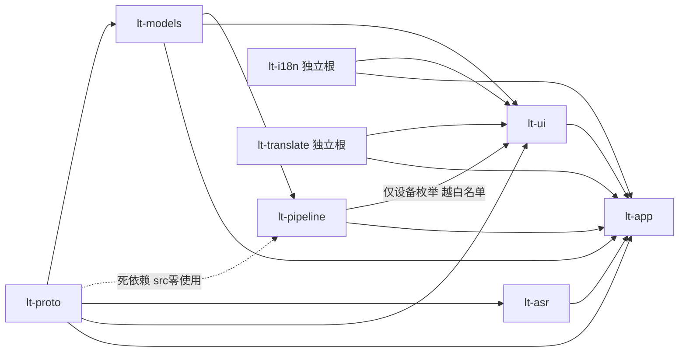
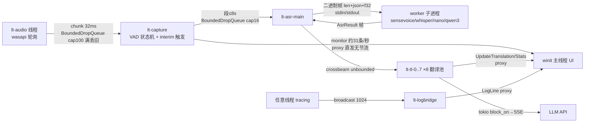

# LiveTranslate-rs 全系统架构深度评审报告
> 归档注记（2026-09-17）：本文已完工归档，头注状态行为归档前原貌，以本注记为准。

- **评审日期**：2026-09-09
- **评审基线**：commit `314644b`（评审执行期间 path-hygiene PH-1~PH-5 收口提交落地），工作区干净，405 测 = 398 常规 + 7 ignored（主线程实测复核）
- **方法**：6 个只读评审子代理分两批并行（每批 3 个、互不干扰），按七维度分工——①基础契约层 lt-proto/lt-i18n/lt-models ②数据通路 lt-pipeline/lt-translate ③ASR 子系统 lt-asr ④UI 子系统 lt-ui ⑤装配层 lt-app ⑥全工作区总体横切；主线程对全部重量级结论逐条交叉验证（复核 9 项、勘误 3 项，见 §7）。视角为高维度架构分析：模块职责、关键数据结构、流程、并发模型、错误策略、演进性；不逐行审码。实机行为（穿透/拖动/DPI/Toast 视觉）与性能预算（WP-9）不在本次静态评审范围。

---

## 1. 执行摘要

一句话总评：**这是一套工程纪律显著高于平均水平的 Windows 桌面产品架构——分层由 cargo 依赖图真实强制、数据面全程有界背压、恢复语义达到产品级、决策史入码；但它同时是一套「把冻结契约守在字面、把演化压力走私进字符串」的架构，并存在三个全局盲区（线程 panic 不可观测、音频采集故障对用户不可见、无 CI）。**

评分表：

| 维度 | 评分 | 一句话理由 |
|---|---|---|
| 模块化 | 7 | 分层真实由依赖图强制、无逆向边；但宣称「八级单向链」与实际拓扑不符（§2.1），lt-ui 汇聚 6 个依赖成事实上的「第二 main」 |
| 并发安全 | 6 | 队列/原子/叶级锁纪律好、UI 单线程独占教科书级；但稳态 ~18 线程、199 处 std Mutex `.unwrap()` 中毒级联、全仓零 panic hook |
| 错误韧性 | 6 | ASR 三振/翻译六分类/下载九失败类恢复语义精细；音频采集静默、线程死亡黑洞、models_dir 失败杀死 ASR 线程 |
| 可演进性 | 6 | 新增引擎改动面 9 处且无一处动协议（抽象成功）；契约冻结被四条字符串旁路消解（§4.1） |
| 可测试性 | 7.5 | 405 测分布合理（fake worker 复用真实 run、headless UI 探针、字形覆盖断言）；零 CI 腰斩价值、编排汇聚点零直接测试 |
| 平台风险 | 5 | Windows-only 事实固化；大量手工 Win32 对抗三方库缺陷（EXSTYLE 重写/TrackPopupMenu/drag_window），脆弱面大但均有自愈防线 |
| 文档-代码一致性 | 6 | 17 条大坑清单高度可信（逐条能在代码找到防线）；基线数、分层白名单等处漂移（§5 R30） |

五个最重要的发现（均有代码证据；前两条经主线程复核确认）：

1. **P0 · 线程 panic 黑洞**：全仓零 `panic::set_hook`（grep 实证 0 命中）+ release `windows_subsystem="windows"`（`crates/lt-app/src/main.rs:12`）→ 任一管道线程 panic 即僵尸管道（UI 照常渲染、命令静默 no-op），且**文件日志零记录**。
2. **P1 · VAD 模式运行时热切换不生效**：置信度源只在启动构造一次（`make_confidence_source` 全仓唯一调用点 `crates/lt-app/src/pipeline.rs:378`，复核确认），`VadProcessor` 无任何替换置信度源的方法（仅 `update_settings`，`crates/lt-pipeline/src/vad.rs:355`）——用户运行时切 silero/energy/disabled 模式，实际仍跑旧推理源，无日志无提示。
3. **P1 · 契约冻结被四条字符串旁路掏空**：下载进度 `\t` 拼串（`backend.rs:366-397` → `lt-ui/src/app.rs:1978` 反解析）、失败类型 `[net] ` 前缀还原枚举、基准 `"__DONE__"` 哨兵骑日志总线、`UiMsg::Menu("quit")` 字符串命令——结构化数据伪装成日志绕过冻结评审，协议无 schema 无单一权威定义。
4. **P1 · 音频采集失败不可观测**：loopback/mic 故障仅 `tracing::error`（`wasapi_win.rs:400-410`），无对等 UiEvent——ASR 有 AsrUnavailable、翻译有 TranslatorUnavailable、音频什么都没有，错误可见性三层对称性断裂。
5. **P1 · models_dir 失败永久杀死 ASR 线程**（`crates/lt-app/src/pipeline.rs:960-967` 直接 return，复核确认）：与 AH-1「待命可唤醒」哲学自相矛盾；TlSwitch 接收端随之消亡，此后引擎切换命令 `send` 静默失败。

---

## 2. 总体架构

### 2.1 真实依赖图 vs 宣称分层

宣称：lt-proto→lt-i18n→lt-models→lt-pipeline→lt-asr→lt-translate→lt-ui→lt-app 八级单向链。
实测（逐 Cargo.toml 核对 + `cargo tree`）：

与宣称的差异（全部实证）：

1. **链根本不是链**：lt-i18n、lt-translate 是零内部依赖的独立根；lt-asr 只依赖 lt-proto。真实拓扑 = lt-proto 一棵树（models→pipeline→ui）+ 两个独立叶在 lt-ui 汇聚。分层意图未被违反，但「链」是文档想象。
2. **死依赖实锤**：`crates/lt-pipeline/Cargo.toml:7` 声明 lt-proto，src 内 `lt_proto` 零命中（复核 grep = 0）——虚增编译面与「契约消费者」假象。
3. **lt-ui→lt-pipeline 越出 AGENTS 白名单**（白名单仅 lt-models/lt-translate；`crates/lt-ui/Cargo.toml:9-11` 注释自辩「仅设备枚举」）：代价是 UI crate 编译期拖入 ort/wasapi 全家，且设备枚举发生在 UI 帧（COM 枚举阻塞帧）。
4. **lt-models 名不副实**：拉入 reqwest+sha2，实为 947 行完整下载器；对比 lt-asr 因不愿依赖它而本地复制 `probe_models_root`（提交 54f1e03 自述）——分层 purity 的代价是逻辑重复。

另：**AudioBackend trait 在唯一需要它的组合点失效**——`crates/lt-app/src/pipeline.rs:277` 持有具体类型 `WasapiBackend`，跨平台抽象目前是装饰品（路线图不是架构事实）。

### 2.2 端到端数据流全景

数据面：

控制面（反向）：UI `send_cmd`(mpsc) → lt-backend 线程（镜像拦截 + 转发，`backend.rs:82-119`）→ proxy 回环 → AppShell.`handle_cmd` 15 臂（`shell.rs:68-237`）→ 四路下发：audio cmd 通道（换设备）/ `Mutex<Option<VadSettings>>` 槽（capture 逐 chunk 应用）/ `AsrPendingHandle`（transcribe 前应用）/ TlSwitch crossbeam 通道（ASR 线程空闲分支消费）。托盘另走 mpsc + `PostThreadMessageW(WM_APP+1)` 唤醒专用线程。

评价：每跳延迟量级合理（chunk 32ms、段≤8s、ASR RTF 0.1–0.5、翻译 0.5–3s 流式）；数据面两跳均有界丢旧且丢弃有确定性告警节奏（AH-7）。**唯一无界跳 = 翻译任务队列**（慢 LLM + 快语速可无限积压、无水位告警）；proxy 与反向命令面全部无背压（对 UI 正确——绝不阻塞 UI 线程，代价是积压不可见，且 TlSwitch 在 ASR 线程退出后 send 静默失败、引擎切换请求可能凭空消失）。

### 2.3 并发全景

稳态 ~18 线程 + ASR 子进程（winit 主线程、lt-backend、lt-download-session、lt-download、lt-logbridge、lt-audio、lt-capture、lt-asr-main、lt-tl-0..7×8、lt-tray、asr-worker-reader/stderr、tokio runtime 工作线程；worker 子进程内含引擎推理线程）。

核心事实：

- **所有权拓扑是全项目最大亮点**：所有后台线程→UI 只有 EventLoopProxy 一条路；AppState 及全部窗口状态单线程独占（仅 winit 线程触碰）；跨线程共享仅四处且均为刻意设计——`Arc<Mutex<VadProcessor>>`（capture 写/ASR interim peek-trim 读，识别期不持锁）、`InterimControl` 全原子、`AsrPendingHandle`（中毒容忍 `into_inner`）、`vad_update` 信号槽。无锁灾难风险。
- **无锁序设计文档，但锁均为叶级**（无嵌套双重获取）；历史 if-let MutexGuard 死锁模式已系统性清除并制度化成注释（`capture.rs:139-143`）。
- **两个全局性并发风险**：①199 处 std Mutex `.unwrap()`（评审代理实测）——任一方 panic 中毒即级联死亡；②全仓零 panic hook——线程死亡完全静默（§1 发现 1）。
- tokio runtime 纯为 async-openai 服务、8 条翻译线程经 `block_on` 同步等待——用 tokio 而不享受 async 的务实选择，白付调度开销但边界干净（对外纯阻塞 API、无 task 泄漏）。

### 2.4 错误处理全景

用户可见呈现路径矩阵完整度好于多数同规模项目：字幕内嵌 `[error: …]`、托盘 Error 图标+标签、面板识别页红字、翻译页状态行、下载卡片四态状态机、6 种 egui 内嵌确认模态、WinRT Toast、日志窗（DEBUG 全量落文件）。错误分类学完整：ASR 三态（unavailable/restarted/failed）、翻译六分类 + `is_expected` 日志分级、下载 FailKind 九类谓词化（retryable/fallback_candidate 纯函数 + 全组合测试）。

**静默吞错清单**（尖锐点）：

- 音频采集失败仅日志（R4）；
- models_dir 失败杀线程（R3）；
- `JobPool::submit` 停止后丢任务无告警（`pipeline.rs:76-81`）；
- settings 落盘失败仅 `tracing::error`，UI 无感知（`shell.rs:241-243`）——UX 三期「设置保存失败 UI 流」立项的必要性实证；
- `Cmd::Start` 死契约成员：无人发送、无人处理（`shell.rs:235`）；
- 启动 logging 之前失败完全不可见（R11）。

### 2.5 配置与持久化

settings.json 生命周期：load（**损坏当默认、无坏档隔离**）→ sanitize（返回修正清单，兼容工程扎实：条件序列化 + serde default + legacy 别名迁移）→ AppState 真值 → 五个镜像（backend 闭包镜像 / AsrRuntime / PendingHandle / Translator MutableState / VAD 生效值——后者还被 qwen3 钳制主动改写）→ 300ms 面板防抖 ApplySettings + 500ms 位置保存防抖（两个独立机制）→ tmp+remove+rename 原子写。

**内存中 Settings 存在 6 个表示**，一致性不靠单一写者而靠显式同步命令网（TlSwitch::AsrLanguage/Pad、ApplySettings 全量重放、StartDownload 现场重算），每条同步边都有回归测试与真实 bug 背书（M5.1 快照 bug、AH-3 字幕全灭）。能运转，但每加一个运行时可改字段都要人工补同步边——AH-3 类 bug 的结构性温床（R10）。

---

## 3. 子系统评审结论

### 3.1 基础契约层（lt-proto / lt-i18n / lt-models）——全仓最健康

**印象**：~3300 行，依赖纯净度极高；enum + 编译期检查的契约表示法在单 exe、无 CI 约束下是正确取舍。

**优点**：ModelEntry 平行数组注册表 = 下载清单/探测目标/完整性基线的单一事实源（等长校验 + sha256 格式校验 + `const { assert! }` 编译期断言三组防线）；FailKind 谓词化失败分类（重试/回落/前缀三维正交 + 全组合测试）；探测假阴性/假阳性论证入码（死局复现测试）；设备魔法串（`__disabled__`/`__default__`）锁死在 `From` 转换内带 roundtrip 测试；原子写 + 续传 + sync-then-rename + total=None 拒绝收尾堵死「截断文件永久判已缓存」死局。

**问题**：
- P1 三条隐形字符串协议（见 §4.1）；
- P1 `Hub` 枚举滞留 lt-models 致 `Cmd::StartDownload`/`SwitchEngine` 全裸字符串，值域合法性责任摊到每个消费点；
- P1 i18n：579×2 键仅 `quit` 一个键有一致性测试；UI 侧成族动态键（`subwin_anim_*`/`engine_display_*`/`preset_*`）不可静态审计；yaml 解析失败**按空表处理**——语法错误将使整个 UI 显示原始键名且零告警；
- P1 settings 落盘 remove+rename 窗口 + 损坏档无隔离即覆盖（低概率但不可逆的配置全量丢失）；
- P2 幽灵值域成员 `funasr-mlt-nano-2512`（合法设置值但注册表返回 None，回退逻辑三处独立表达）；
- P2 下载退避 sleep（最长 16s）先于 cancel 检查，取消最长等 16s。

### 3.2 数据通路（lt-pipeline / lt-translate）——核心无结构性缺陷

**印象**：原版拓扑保真（队列容量/chunk 32ms/轮询节拍逐条对齐）+ Rust 工程加固（散字段→原子控制块、异常→分类枚举）的混合体；数值正确性有 Python fixture 逐 bit 锚定。

**优点**：**乐观代际校验替代悲观锁**（VAD `generation` 单调号 + `trim_front_checked`，既不阻塞采集又杜绝误裁新段头部，全仓最精巧并发设计）；锁纪律制度化（先绑定再分支零例外）；BoundedDropQueue 一处实现三处复用（满丢最旧 + 确定性丢弃告警）；tokio 边界成熟（`TranslateStream` 把 async 流伪装成同步迭代器，消费方零 tokio 知识）；算法层与接线层彻底分离（interim.rs 635 行纯函数、`interim_due` 真值表、`ConfidenceSource` 注入）。

**问题**：
- P1 **VAD 模式热切换不生效**（§1 发现 2，复核确认）：冷启动正确、热切换错误——silero→energy 后仍跑 Silero ORT 推理且 `energy_threshold` 彻底失效；「恒 1.0 永在说话」的 disabled 语义丢失；用户调了没效果且无日志；
- P1 采集故障域耦合 + 无限重试不可观测：mic 故障期间整个 loopback 读取停摆（共线程互相放大），段从中间缺失；loopback 打开失败无限重试仅日志；
- P2 UpdateMonitor 每 32ms 一发（≈31/s）proxy 无节流；EventLoopProxy 是全链路唯一无背压环节；
- P2 同语言免翻译 `lang == target_language` 隐式字符串契约（"zh" vs "zh-CN" 格式一致性无类型保证）；
- P2 设备切换清 chunk 队列但不清段队列/不复位 VAD 状态——新旧设备尾头段可能拼接出错位段；
- P2 `AudioBackend` trait 契约泄漏（具体队列类型 + 魔法字符串 + `contains` 设备名匹配进 trait）。

### 3.3 ASR 子系统（lt-asr）——全仓边界最清晰

**印象**：进程隔离 + 长度前缀帧 IPC + 管理层状态机三件套，3625 行承载 4 引擎。走子进程四动机成立（崩溃隔离——fake worker 专门注入 `abort()` 验证；挂死推理只有进程可杀；RSS 确定性回收；同 exe 自拉起保单 exe），代价（重载 2.9–4.15s、识别中段必丢、词级时间戳被压掉）被管理层系统性对冲。

**优点**：**fake worker 复用真实 `worker::run`**（行为注入走 options JSON，主循环漂移在架构上不可能）；错误分类三值穿透全栈无折损（`EngineError::recoverable` → `ErrorInfo` → 三振/恢复分叉）；stdout 纪律制度化（whisper print_* 显式关闭 + stderr 行界 drain + 1MB 截断）排除 C++ 污染协议通道；引擎切换失败回滚旧 worker、回滚也失败才 unavailable 且 UI 标签恢复旧显示名；三层孤儿防护（优雅 shutdown 5s→kill→Job Object KILL_ON_JOB_CLOSE + Drop kill）；IPC 帧自解析边界（`byte_offset` 定位 JSON 结束）实现严谨。

**问题**：
- P1 60s 恒定超时把「慢」当「挂死」且不随引擎/模型档自适应——慢机合法慢推理烧穿三振恢复配额进入假死不可用（AH-8 已为 set_* 提到 60s 自证此痛，transcribe 侧同样暴露）；
- P1 `engines/` 收敛未完成：sensevoice.rs 残留 `normalize_language` 私有副本（其余引擎已用共享版）——D-30 类语言语义修改有改一漏一的实际风险；`pad_samples` 也有两份同语义实现；
- P1 qwen3 段长钳制「写穿」共享 VAD 配置（切离 qwen3 后用户 30s 设置静默退化 15s，依赖用户下次「应用」才恢复）且钳制逻辑两处散点；
- P2 控制面寄生数据面空闲分支（持续语音期间切换延迟到静默间隙；IPC 无 Cancel，busy 中无法打断在途 transcribe）；
- P2 帧读取按长度前缀整块分配（上限 256MB）；`Status::Created` 死代码；空闲 RSS 回收每 500ms 新建 `sysinfo::System`；
- P2 `display_name` 参与 WorkerConfig 签名——纯显示名变化会触发整 worker 替换+模型重载（当前构造路径不触发，潜在地雷）。

**演进性**：新增引擎改动面 9 处、无一处需动协议或恢复体系（抽象成功；弱点是 3 处字符串 match 散点，AH-6 全集装配防线测试兜底）。加流式 ASR：协议层不用推翻（帧协议天然支持 id=None 推送通道、interim 代际校验就是为流式本质设计的），但 worker 骨架（单请求串行 for 循环）要重写一版。

### 3.4 UI 子系统（lt-ui）——实战淬炼，债务全是「增长痛」型

**印象**：自研多窗口宿主（不使用 egui viewport 体系，单 Context 手工 6 原生窗口 + 每窗独立 `egui_winit::State` + 共享 Painter）+ Qt 事件模型（QTimer/动画/模态语义）系统性移植，移植纪律极高。架构主轴清晰：**UI 帧零副作用（除 AppState 与动作队列），一切窗口操作收敛到帧后 `process_actions`**。

**优点**：WinAction 动作队列协议（15 变体）优雅化解「egui 无窗口句柄」——借用边界与失败面收敛；Tick 表完美移植 QTimer 语义且无节拍时 `WaitUntil(3600s)` 深度睡眠（空闲零自旋）；托盘线程协议教科书级（建队列时序/模态吞唤醒补偿/限时退出，每个 Win32 细节有根因注释 + 非阻塞测试钉住）；字体仓库自洽成为可测试硬保证（三内嵌字体链尾兜底 + `resolved` 表使 `FontFamily::Name` 不可能未注册 + 常驻字形覆盖测试）；EXSTYLE 每帧实测重挂把 winit 对抗变成 3 行幂等代码；headless 测试贯穿（`ctx.run_ui` 驱动真实 UI 闭包断言）。

**问题**：
- P1 **字幕窗开关持久化不对称**（复核确认，且比初报更尖锐）：同一函数内相邻两路径行为分叉——穿透开关落盘（`subtitle.rs:706-709` 调 `mark_settings_dirty`）、隐藏开关不落盘（`subtitle.rs:717-721` 只写内存）；overlay.rs 全文零落盘调用（复核 grep = 0）；CloseRequested 同病 → 用户用按钮/X 关字幕窗，重启后字幕窗复活；
- P1 AppState 巨石：state.rs 3043 行、~40 字段横跨 6 窗域，`dispatch` 把 `&mut AppState` 全量交给每个窗口帧——所有权边界纯靠命名纪律；
- P1 lt-pipeline 越白名单依赖 + 设备枚举在 UI 帧（COM 枚举阻塞帧，复核确认 Cargo.toml:9-11）；
- P1 可见性双真源：`app_state.visible` 与 `window.is_visible()` 读侧混用（托盘菜单读后者、穿透轮询读前者）——任何绕过 `set_visible` 的路径即漂移；
- P1 同步 `rfd::FileDialog` 仍占事件循环线程（D-33 纪律的残留特区，H-5 只收敛了 MessageBox 类）——模态期间全部 egui 窗口（含实时字幕窗）冻结；
- P2 悬浮窗 `WinAction::Drag` 仍走 `drag_window()`（D-37 已知同病待修）；bench `"__DONE__"` 哨兵；`(WinId, WinAction)` 无配对校验；模态宿主资格判定双份口径（content_rect vs inner_size）；`ThemeMode/start_hidden/reduce_motion` 因 lt-proto 缺键仅内存态重启即失；tray event handler 进程级全局单例。

**「轮询+自愈」架构专项评价**：50ms/100ms Win32 轮询与每帧 EXSTYLE 实测的 CPU 代价可忽略（微秒级调用、节拍与渲染解耦、豁免逻辑全部收敛在轮询函数内无打架）；事件驱动替代（WM_STYLECHANGED 子类化）收益仅是概念洁癖，不值得引入 WndProc 子类复杂度。**结论：这套防御式架构是对的选择**，唯一要求是把「每帧实测」纪律延伸到未来任何手工窗口位（大坑 15 已抽象成规则）。

**egui 升级评估**：渗透面大（手拼 viewport 全套/手动光栅化管线/每帧样式注入/`request_inner_size` 异步语义/fonts 闭包）——0.36→0.4x 实质是宿主层重写；但所有奇癖已被显式代码钉死且注释根因，升级是「对照注释逐点复核」而非考古。

### 3.5 装配层（lt-app）——壳一流、芯寄居

**印象**：3059 行中真正纯装配只有 main.rs + shell.rs ~470 行；`pipeline.rs`（1490 行码 + 395 行测）是完整编排域层——段三层过滤、interim 全编排（回声剥离/分句/比例裁剪/代际校验）、TlSwitch 七臂路由、自研 8 线程 JobPool、ASR 线程「待命 + 主循环」双状态机、引擎切换全链路含失败回滚。「事实上的第七个 crate」表述不准，实为**编排域无家可归、暂住组合根**（它就是原版 main.py 的 `_asr_loop`/`_capture_loop` 编排层本身）。

**优点**：单写者 + 单回流通拓扑（D-33~D-37 一系列窗口坑修复的可推理基础）；托盘线程协议范本；worker 孤儿防护三层闭环；失败可见性纪律成体系（pipeline_error 红字/边沿触发去重/下载磁盘预检快速失败）；AH-6 全集装配防线测试直接针对现实发生过的缺陷；文档-代码双向锚定（几乎每个非平凡决策点带 D-xx/AH-x 注释）。

**问题**：
- P1 **启动早期失败完全不可见**：logging::init（main.rs:42）之前的失败（ORT 解压/单实例/settings 损坏/wgpu 初始化）一律 `?`/`bail!` 出 main，release `windows_subsystem` 下 stderr 黑洞——分发场景最常见故障（C 盘满解压失败、误双击二次启动）表现为「双击后无事发生」；
- P1 单实例半语义：`OpenMutexW` 探测后 `bail!`（main.rs:84-88）——不激活已有窗口（WD-5 确认未做）+ 探测-创建 TOCTOU 竞窗；
- P1 **`Pipeline::start` 半初始化泄漏**：`backend.start()` 成功后若 capture/asr 线程 spawn 失败 `?` 直接返回，`WasapiBackend` 无 Drop impl（全文 grep 无）——音频设备被幽灵线程独占到进程退出；
- P2 设置三镜像一致性靠约定：`ApplySettings` 300ms 重放路径不同步 asr_language/pad 镜像（靠面板「变更即发专用命令」补齐）——AH-3 类 bug 的结构性温床；`SwitchEngine` 的 hub 臂 backend 更新镜像而 shell 显式丢弃；
- P2 日志桥每条 INFO+ 经 broadcast→proxy 变一枚 winit user event，逐条直灌主循环无合帧；
- P2 线程 panic 静默 + 无 panic hook + 无 Ctrl-C 处理（全仓 grep 零命中）；lt-tl 线程不 join（在飞翻译靠 HTTP 超时自然结束）；
- P2 worker 配置走 argv（`--asr-worker <config-json>`）——模型绝对路径在任务管理器命令行可见，且参数位置依赖 `skip_while(...).nth(1)`。

**退出序列评价**：整体顺序正确（确认模态→event_loop.exit→pipeline.stop（stop 标志 + join 全线程 + worker shutdown 5s ack→kill）→settings 终写→托盘 Quit+ack 2s 限时分离→Job Object 收尾），未发现死锁级问题。

---

## 4. 横切专题

### 4.1 契约冻结制度的实际效力

lt-proto 结构在**类型层面**守住了；但演化压力从四条字符串旁路泄出：

| 旁路 | 载体 | 两端 |
|---|---|---|
| 下载进度走私 | `"{人读段}\t{file}\t{k} {n} {done} {total}"` | `backend.rs:366-397` 格式化 → `app.rs:1978` `split_progress_line` 反解析 |
| 失败类型走私 | `"[net] "` 前缀 + `Display` | lt-models 测试自述「契约不变：DownloadFailed 仍是 String」→ `state.rs:1271-1290` 逐前缀还原枚举 |
| 基准控制流走私 | `LogLine{target:"benchmark"}` + `"__DONE__"` 哨兵 | 控制平面信号寄生在日志数据平面，日志窗混入不可读机器行 |
| 无类型侧信道 | `WorkerConfig.options: serde_json::Value`；`UiMsg::Menu("quit")` | 冻结结构旁的自由区、字符串 id 当内部命令 |

**评判**：冻结制度迫使每次新能力都要评审，于是工程选择「把结构藏进 String 绕过评审」——制度守住了字面、丢了实质；真实契约活在无 schema、无版本、无单一权威定义的字符串里，任何一端改格式都能编译通过，仅靠散落测试兜底。

**方向**：值域扩展本就在冻结豁免之列——把三条旁路类型化（`DownloadProgress`/`DownloadFailed` 升格为带 payload 的枚举变体、bench 输出与日志分流）即可；并建议冻结规则显式豁免「纯新增类型化变体/枚举项」，评审火力集中在删改，否则字符串走私只会继续增殖。

### 4.2 测试架构

实测分布（grep 复核）：lt-proto 14 / lt-i18n 4 / lt-models 51 / lt-pipeline 76 / lt-asr 46 / lt-translate 40 / lt-ui 146 / lt-app 28 = **405，其中 ignored 7**（真模型/真网络探针，离线纪律执行到位）。AGENTS 顶部「399+6」已过时（见 R30）。

- **保护得好**：协议往返、状态机数学（VAD/interim）、镜像同步、窗口状态不变量、字形覆盖、fail-kind 全组合。
- **没保护**：端到端事件链（fake worker 只测到 Manager 层，pipeline→translation→UiEvent 全链无集成测试）；线程死亡场景（panic 中毒/join 挂死）；实机窗口行为（拖动/穿透/DPI 全靠人工走查清单）；性能预算（WP-9 未做）；`handle_cmd` 这个所有 Cmd 的汇聚点零直接测试。
- **无 CI 把 405 测的价值腰斩**：回归防护完全依赖提交者自觉跑全量——历史 stash 事故证明人为环节必失手（流程性 P1）。

### 4.3 构建与分发

「轻 build.rs + 重 cargo [env]」路线：uv 钉版 libclang 进仓库 .venv（根治本机路径）、sherpa 库预取硬失败不回落（可重复构建）、双栈 CRT 和解（`CMAKE_MSVC_RUNTIME_LIBRARY` + `CMP0091=NEW`）——「clone 后零配置」做到了。单 exe 75,756,544 字节实测与宣称一致（内嵌 onnxruntime.dll + silero_vad.onnx 启动解压 + 三字体 brotli ~13MB + windows crate WinRT 绑定 ~13MB）。跨平台抽象（AudioBackend trait）是路线图不是架构事实（wasapi/Win32/Toast/托盘四处 cfg(windows) 深植 + 组合点持具体类型）。分发硬依赖 VC++ Redist 与 distribution.md 旧断言的矛盾已被 data-lifecycle 盘点实证，随 WD-1 修订。

---

## 5. 风险登记册（合并去重 + 交叉验证）

标记 ✓ = 主线程 grep/Read 二次确认；「代理」= 评审代理给出具体行号证据、主线程未重复取证；「×2」= 两个独立代理收敛。

| # | 级 | 风险 | 关键证据 | 验证 |
|---|---|---|---|---|
| R1 | P0 | 线程 panic 黑洞：零 panic hook + windows_subsystem + 199 处 Mutex unwrap 中毒级联 → 僵尸管道且日志零记录 | grep set_hook=0；main.rs:12 | ✓ |
| R2 | P1 | VAD 模式运行时热切换不生效（置信度源无替换路径） | vad.rs:171/355；唯一构造点 lt-app/pipeline.rs:378 | ✓ |
| R3 | P1 | models_dir 失败永久杀死 ASR 线程，TlSwitch 静默消亡（与 AH-1 矛盾） | lt-app/pipeline.rs:960-967 | ✓ |
| R4 | P1 | 音频采集失败不可观测（三层错误可见性对称性断裂）；mic/loopback 共线程故障互放大 | wasapi_win.rs:400-429 | 代理 |
| R5 | P1 | 契约冻结四条字符串旁路（§4.1） | backend.rs:366-397/127、bench.rs:288、pipeline.rs:754 | ×2 |
| R6 | P1 | ASR 60s 恒定超时烧穿恢复配额→假死不可用 | client.rs:127/203-205 | 代理 |
| R7 | P1 | 字幕窗开关持久化不对称（同函数相邻路径分叉） | subtitle.rs:709 vs 717-721；overlay.rs=0 | ✓ |
| R8 | P1 | AppState 巨石 + `&mut` 全量分发，边界靠命名纪律 | state.rs 3043 行/~40 字段 | 代理 |
| R9 | P1 | 编排域寄居组合根（pipeline.rs 1490 行）+ transcript_shared 全局单例 | lt-app/pipeline.rs:334-350 | ×2 |
| R10 | P1 | 设置六镜像一致性靠人肉同步网（ApplySettings 重放缺口） | shell.rs:207-233 | ×2 |
| R11 | P1 | 启动早期失败完全不可见 + 单实例半语义（不激活旧窗/TOCTOU） | main.rs:12-94 | ×2 |
| R12 | P1 | Pipeline::start 半初始化泄漏（WasapiBackend 无 Drop） | wasapi_win.rs 无 impl Drop | 代理 |
| R13 | P1 | lt-ui 越白名单依赖 lt-pipeline + UI 帧 COM 设备枚举 | lt-ui/Cargo.toml:9-11 | ✓ |
| R14 | P1 | i18n 无键集全量校验 + 动态键不可静态审计 + 解析失败静默空表 | lt-i18n/lib.rs:42-45/140-144 | 代理（键数 579/579 已复核一致） |
| R15 | P1 | 翻译任务队列无界无水位告警 | lt-app/pipeline.rs:55 | ×2 |
| R16 | P1 | 无 CI（405 测价值腰斩） | .github/workflows 不存在 | 已知 |
| R17 | P2 | settings 落盘 remove+rename 崩溃窗口 + 损坏档无隔离即覆盖 | settings_io.rs:15-20/36-40 | ×2 |
| R18 | P2 | qwen3 段长钳制写穿共享 VAD 配置 + 钳制逻辑两处散点 | lt-app/pipeline.rs:649-656/1127-1137 | ×2 |
| R19 | P2 | 同步 rfd FileDialog 冻结全部 egui 窗口（D-33 残留特区） | app.rs:1733 | 代理 |
| R20 | P2 | 窗口可见性双真源 | app.rs:463 vs 1598 | 代理 |
| R21 | P2 | sensevoice.rs 残留 normalize_language/pad_samples 私有副本 | sensevoice.rs:140-145/197-204 | 代理 |
| R22 | P2 | 悬浮窗 Drag 仍走 drag_window（D-37 已知同病） | app.rs:1119-1121 | 代理 |
| R23 | P2 | proxy 无背压：日志逐条直灌 + monitor 31/s 无节流 | logging.rs:127-147 | ×2 |
| R24 | P2 | 下载退避 sleep（≤16s）期间取消不响应 | download/mod.rs:367-374 | 代理 |
| R25 | P2 | 幽灵值域成员 funasr-mlt-nano 三处独立表达 | registry.rs:243-244 | 代理 |
| R26 | P2 | transcripts_dir 失败回退相对路径写 CWD（路径卫生盲点） | lt-app/pipeline.rs:345-347 | 代理 |
| R27 | P2 | 死契约 `Cmd::Start` / 死依赖 lt-pipeline→lt-proto / `Status::Created` 死代码 | shell.rs:235；Cargo.toml:7（✓ 0 引用） | ✓部分 |
| R28 | P2 | worker 配置走 argv（模型路径进任务管理器命令行 + 位置依赖） | main.rs:23 | 代理 |
| R29 | P2 | ThemeMode/start_hidden/reduce_motion 无契约键重启即失 | state.rs:1242-1249 | 代理 |
| R30 | P2 | 文档漂移：基线 399+6 → 实测 398+7；AGENTS 分层白名单漏 lt-pipeline | AGENTS.md | ✓ |
| R31 | P2 | 设备切换不清段队列/不复位 VAD 状态（新旧设备段拼接错位） | wasapi_win.rs:455 | 代理 |
| R32 | P2 | tray event handler 进程级全局单例（第二菜单源互相覆盖） | tray.rs:320-327 | 代理 |

---

## 6. 改进路线图

### 第一批：止血（小改面、大收益，可合入任意工作包）

1. **R1**：全局 `panic::set_hook` 桥接 tracing + 管道线程 join `Err` 上报 UiEvent（线程死亡可见化）。
2. **R4**：音频采集不可用 UiEvent（对齐 AsrUnavailable 边沿触发模式，零 lt-proto 结构扩展）。
3. **R3**：models_dir 失败改待命态可唤醒（对齐 AH-1 哲学）。
4. **R14（部分）**：i18n 双语键集全量断言测试（`assert_eq!(zh.keys(), en.keys())`，一条测试根治）。
5. **R2**：`VadProcessor` 加 `set_confidence_source`（默认泛型参数已是 Box）或 VadSettings 槽协议携带模式变化标志由 capture 应用点重建源 + 运行时切模式集成测试。
6. **R30/R13**：文档勘误（基线 398+7；白名单收录 lt-pipeline 或移除该依赖改枚举下沉）。

### 第二批：结构卫生（2-3 个工作包）

7. **R5**：三条字符串协议类型化（DownloadProgress/FailKind 载荷升格枚举变体、bench 与日志分流）+ 冻结规则显式豁免「纯新增类型化变体」。
8. **R7/R10/R17**：字幕开关落盘收敛为单一帮助函数；ApplySettings 重放时对全部运行时镜像做一次幂等 sync；settings 落盘 rename 优先 + 坏档隔离。
9. **R11/R12**：启动早期失败 MessageBoxW（此时尚无事件循环线程，D-33 禁令不适用）+ 第二实例激活旧窗（WD-5）；Pipeline::start 守卫回滚。
10. **R6/R18/R15**：ASR 超时按引擎/模型档注入；qwen3 钳制改 overlay 层（effective = min(user, engine_cap)，用户原值不可变）；翻译池「只保留最新 N 个待译段」+ 水位告警。
11. **R16**：CI——GitHub Actions windows runner 跑 `cargo test`（ignored 探针纪律保持）。

### 第三批：结构性（独立立项、各自评审）

12. **R9**：新增 `lt-orchestrator` crate 整体迁入编排域（边界现成：shell 只调 `Pipeline` 七个方法；前置手术 = transcript_shared 改显式注入 + AH-6 防线测试随迁；无契约变更）。
13. **R8/R20/R19**：AppState 按 WinId 拆上下文（至少 bench/download/startup 收进子结构）；可见性单真源；rfd 异步化。
14. **R13/R27**：lt-pipeline 死依赖清理；设备枚举下沉 lt-app 注入快照或抽轻量 backend-trait crate。
15. **R22/R21**：悬浮窗 Drag 手工化（D-37 同法）；sensevoice.rs 迁入 engines/ 收编共享副本。

---

## 7. 评审方法附注与勘误（交叉验证记录）

- **基线变动**：会话开始快照 HEAD=`a9a5cc0` 且有未提交改动；实际评审执行于 `314644b`（path-hygiene PH-1~PH-5 期间落地），工作区干净。快照所指 `crates/lt-asr/src/engines/mod.rs` 未提交改动**不存在**（该文件最近一次改动 54f1e03 已提交，PH-1a 探针 env 化）。
- **勘误一**：总体评审代理称 i18n 实测 573 键、与宣称 579 漂移——主线程复核 zh/en 均 579 个顶层键，**一致，无漂移**。
- **勘误二**：总体评审代理称「防抖文档 300ms 实际 500ms 漂移」——复核为两个并存机制：面板设置防抖 300ms（state.rs:2005-2029 注释与实现一致）、窗口位置保存防抖 500ms，**非漂移**。
- **二次确认清单**（重量级结论逐条 grep/Read 复核）：panic hook = 0 命中；`make_confidence_source` 全仓唯一调用点；models_dir 分支 return；overlay.rs 零落盘调用；subtitle.rs:709 落盘 vs :717-721 不落盘的相邻分叉；lt-pipeline 对 lt-proto 零引用；lt-ui Cargo.toml 越白名单声明；ignored 测试 7 个；i18n 键数。
- **局限性**：静态评审不含实机行为（穿透/拖动/DPI/Toast 视觉——依项目纪律待用户截图走查）；性能预算（WP-9 启动<2s/空闲 CPU<1%/8h 长跑）未评审；子代理测得的行数/计数可能随后续提交漂移。
